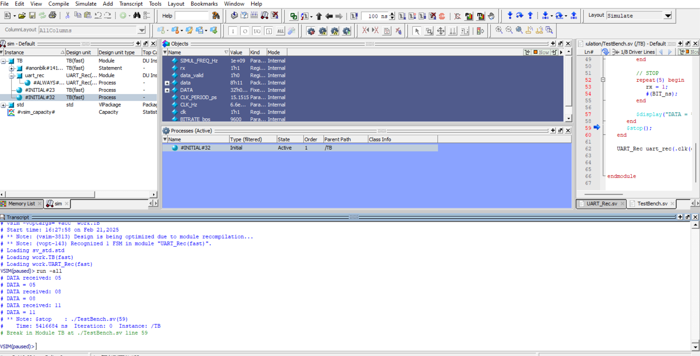

# ReceiverModule
UART receiver - module to receive the byte of the clicked key

Project consists of two directories:
* Hardware
* Software

There is the UART_rec.sv file in both directories - it is the actual module based on a state machine consisting of four states. The hardware directory also includes the shield_test.sv file - this is the top module with which it is possible to test the environment by pressing keys on the keyboard. The four least significant bits will be presented on the LEDs. There is also a TB file in the simulation directory - three sample inputs are provided. The last file - sim.do is the Questa executable file.

Project was tested on Intel Max V CPLD with UNO R3 Mega 2560 overlay. Simulation was performed using Intel Questa environment.

